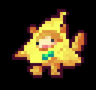
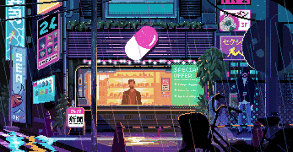

# 🌟 Welcome to My Digital Universe

  
  
  

  <h3>✦ ✧ ✧ Fullstack Web3 Developer | Blockchain Explorer | Game Developer ✧ ✧ ✦</h3>

---

  
  
  
  

 

  

---

##  About Me

**ıllıllı Passionate Digital Creator ıllıllı**

I specialize in creating innovative digital experiences across Web3, AI, and game development. My journey involves continuously enhancing skills in:

- 🔐 **Zero-Knowledge Proofs** - Building privacy-focused solutions
- ⚡ **Solidity Optimization** - Creating efficient smart contracts
- 🛡️ **Smart Contract Security** - Ensuring bulletproof blockchain applications
- 🎮 **Game Development** - Crafting immersive digital worlds
- 🤖 **AI Integration** - Pushing the boundaries of intelligent applications

I'm eager to contribute to impactful projects and collaborate in forward-thinking tech environments!

  <h3>
    "I love Cat  and Zelda "
  </h3>

---

##  Tech Arsenal

### **💻 Programming Languages**

### **🎨 Frontend & UI/UX**

### **⚙️ Backend & Server**

### **🔗 Blockchain & Web3**

### **🗃️ Databases**

### **🛠️ DevOps & Tools**

### **🎮 Game Development**

### **🤖 AI & Experimental Tech**

---

##  GitHub Analytics

  
  

---

## 🤝 Let's Connect & Collaborate

### **Ready to build the future together?**

Whether you're interested in Web3 innovation, game development, or AI exploration, I'm always excited to connect with fellow developers and creators!

---

  <h3>🙏 Thank you for visiting my digital space! 😊</h3>
  
<em>⭐ Star my repositories if you find them interesting!</em>

  
  
  

---
